# Bio-Shop

In the context of the pandemic, many of the local markets where vegetables, fruits, cheeses, were forced to close, so it was a loss both for the local farmers who could no longer sell their goods but also for the buyers who had to do their shopping only in supermarkets. Therefore, through the BioShop application the creation of a web application was pursued where local farmers could post their products, thus facilitating the sale-buying process. This application has two types of users: the seller mode that allows the posting of products and the mode of buyer in which he has the facility to buy the products. In achieving the following technologies are used for this web application: the Go language through which a developed the back-end part, the PostgreSQL relational database and the front-end is made by the Javascript framework Vue.js.

# Database schema

# Application use-cases
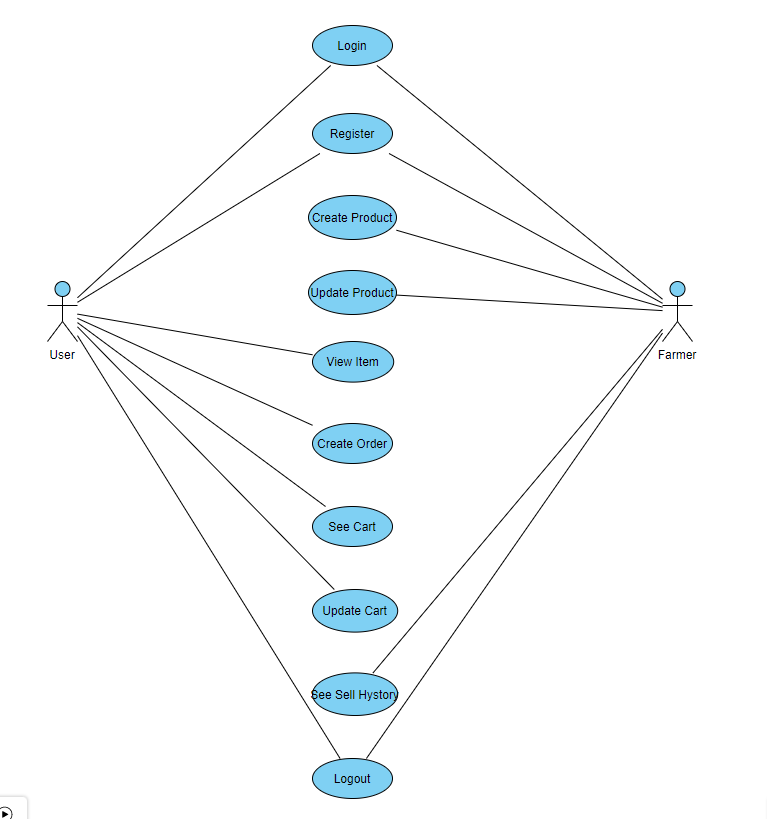

# Application architecture

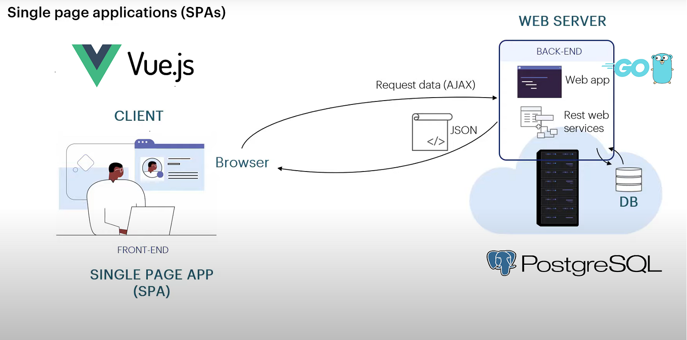

# Application overview

The BioShop store
provides two types of users: User and Farmer. Each of them have
different functionalities and perspectives available.
The first page of the application is represented by the store's slogan and the two User and Farmer buttons through which the user can choose his role

The user, after selecting one of the two options, will be redirected to
the Login page, where you must enter your email and password to log in
in the application. If the password or email is wrong, popups with errors will appear corresponding to the missing or wrong field.

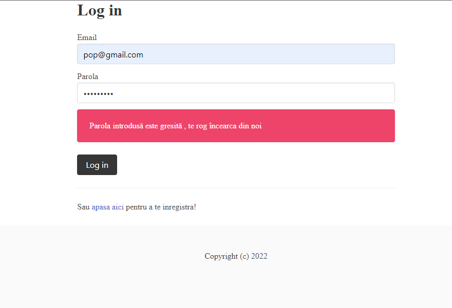

If the user does not already have an account created, he can click on the "apasa aici" link to be redirected to the Register page. Once on the page of
Register the user must complete the following information to be able to
to create an account, such as: name, surname, password, address, email and age. If
in which the user omits to complete one of the fields and presses the button
sign-up, a pop-up will appear in which you will specify what you forgot to enter.

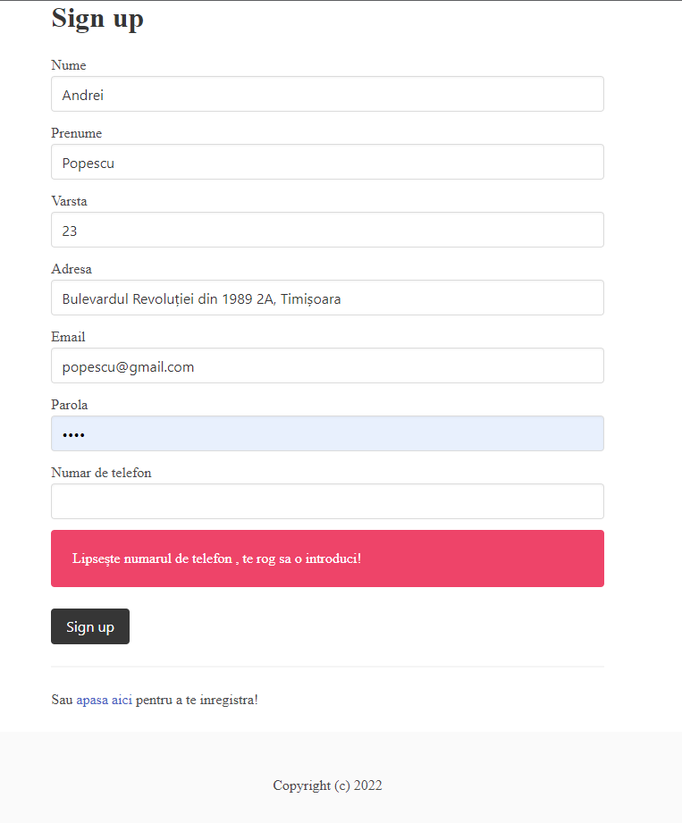
So, once the user chooses the role of User or Farmer, he manages to
create an account and authenticate in the application, it will have two different perspectives
User and Farmer that will be presented next.
From the User's perspective, the web page is divided into 3 areas: the navigation bar,
the content area and the footer of the page. The navigation bar and the footer of the page are done
as components that are reused in the rest of the pages in the application, thus doing
easier and faster development experience. The navigation bar includes a
link to the index page consisting of the store name, the search box, the button
which displays the menu with the available categories, the exit button from the application that will
remove the user from the current page and the cookie and the basket button will be deleted shopping where you can view your products and place your order.

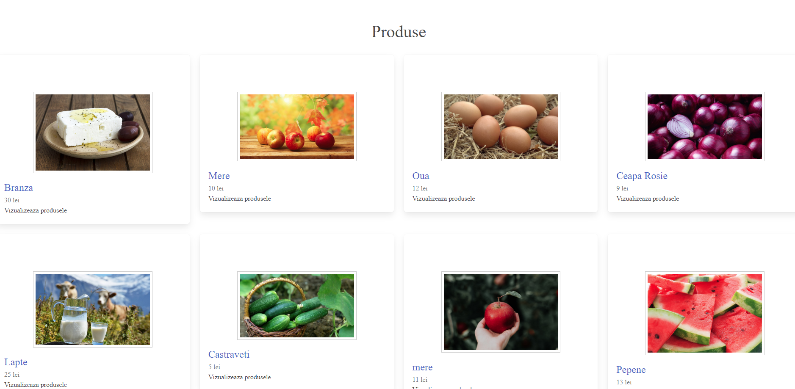
Next, the user has the option to view the desired product in detail
by clicking on its name, which represents a link to the product's viewing page.In this section, information related to the seller of the product is displayed:

email and phone number, in case the user wants to contact him.
At the same time, the price of the product is also displayed, the customer has the option to select
the quantity you want, you can purchase it, if the user chooses a larger quantity
than the current stock of the product, a will appear in the lower right part of the screen
pop-up with the respective error. On this page, there is also a button through which
the user can add the product to the shopping cart and a more detailed description
of the product.

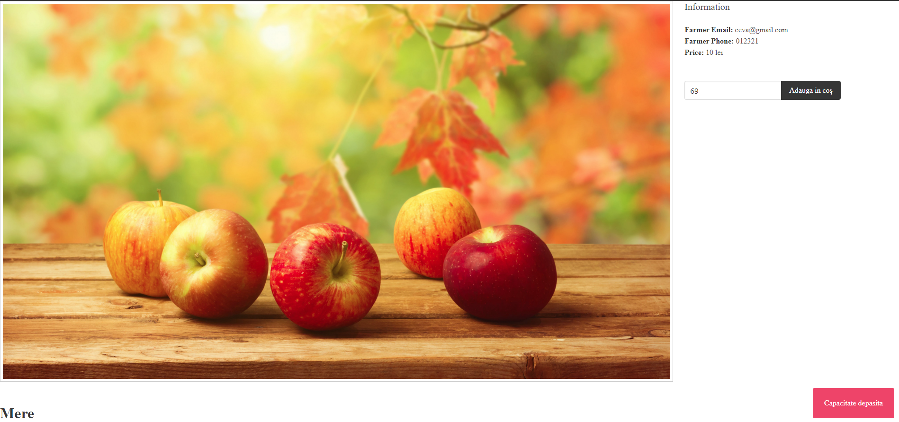
To search for the products of interest, the user has two options to do this
thing: search by product name or search by product category. In the
search box, the user can enter the whole name or part of it and
the search algorithm will display the desired products.

The other search alternative, where the user can press the related button
category section. In this section, a list of all available categories will be displayed.
Once the category is chosen, only the products that belong to the category will be displayed
desired.
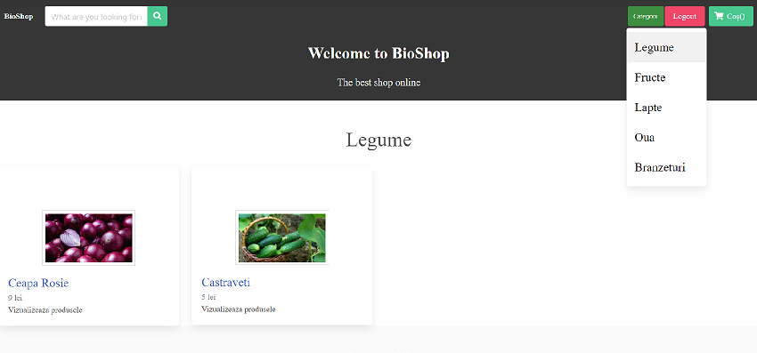
To continue the purchase process, the user can press the button
"cos" and will be redirected to the page
"Cos de cumparaturi", where they are displayed
the products added to the basket and their information. At the same time, it has the possibility to
to change the quantity of the products in the basket or to delete them. At the bottom of the page
the total price of the products and their number is displayed.
To complete the order, the user must press the button
"finalizeaza comanda". Once this button is pressed, the shopping cart will be emptied, and the user
will be redirected to the page
"cumparaturi efectuate cu succes".
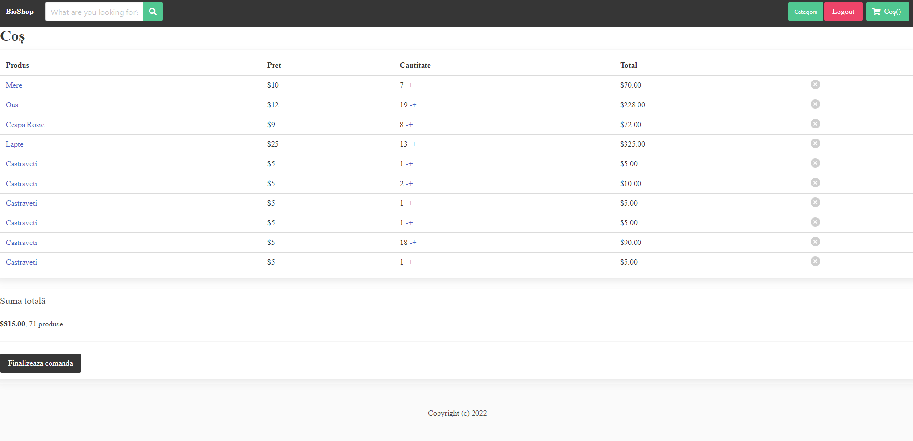

Next, each page is presented from the perspective of the farmer.
From the perspective of the farmer, the web page has a structure similar to that of a
client, it is divided into 3 areas: the navigation bar, the content area and the footer
of the page. The navigation bar includes a link to the index page formed by the name
the store, the search box, the button that displays the menu with the available categories,
the exit button, exits the application which will remove it from the current page and it will be deleted
the cookie, the button through which he can create a product and the button
"istoricul vanzarilor",
where the farmer can see his history of products sold.

In the farmer's index page, their own products are displayed. He has the possibility
to update or delete them. Each of these products represents a
component with attributes such as image, product name, price, update button
and deletion.
The farmer has the possibility to update a product by pressing the button
"actualizare",
once pressed, it will redirect him to a form where he can enter one
or more fields to update the already existing product.

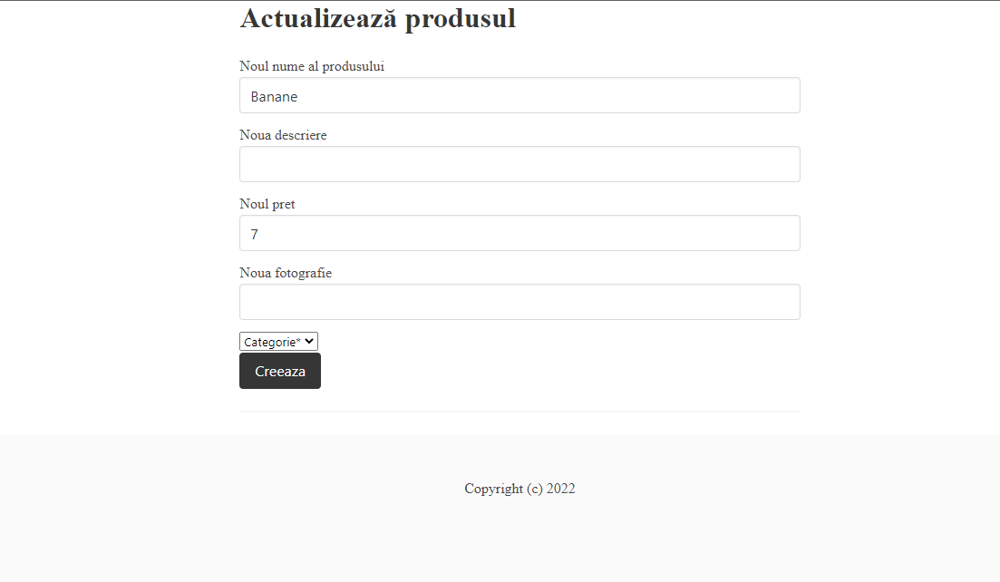
The farmer can search for his own products by their name or by category
specify. In the search box, the farmer can type the full name of the product
or, part of it and the search algorithm will return the desired objects. If
in which he enters a name or a group of letters, which does not exist, and the message will appear
"Nu exista un produs cu acest nume, te rog mai ıncearca".

The farmer has the possibility to add a new product. When pressing the "Creare produs" button on the navigation bar, the farmer will be redirected to a form in which you must enter the details of the new product: product name, description
price, picture, quantity and category. If the farmer omits a field, he will receive one
pop-up with the missing field.
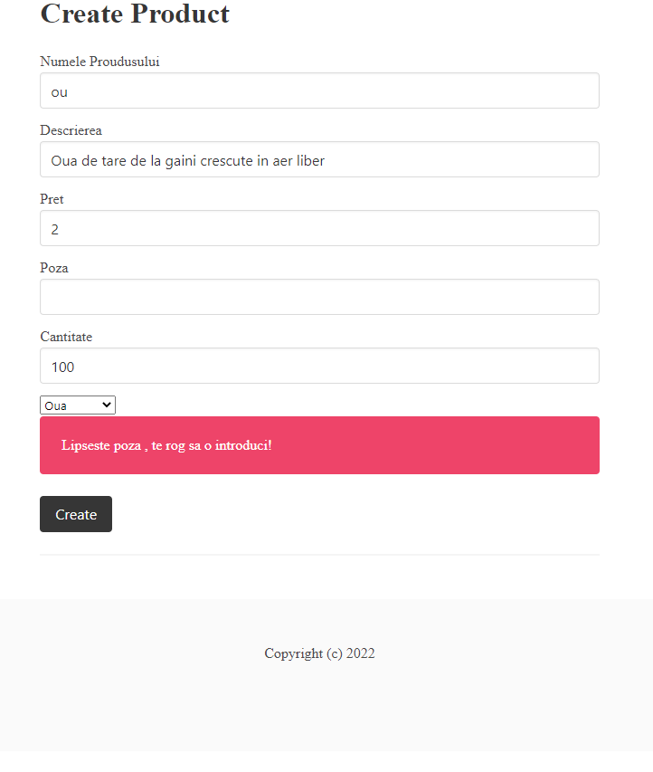
When the farmer wants to see what products he sold and the total amount of money, he will
could press the button
"Istoric vanzari", on the right side of the navigation bar and
will be redirected to the page "
Istoric vanzari". On this page, the farmer will
view a table with the name of the products, price, the number of each product, the quantity and the price
final. At the bottom of the page, you can find the total amount of the products sold as well
their number.
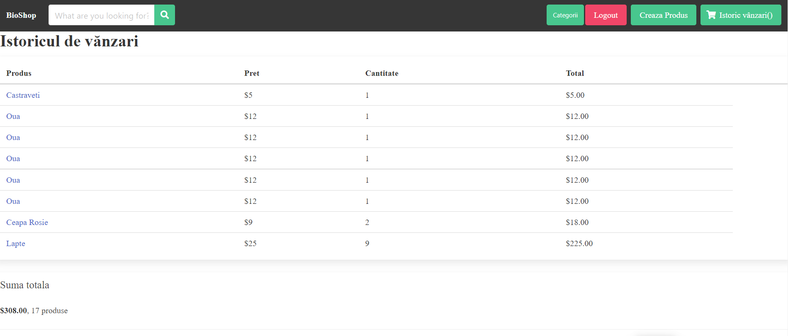